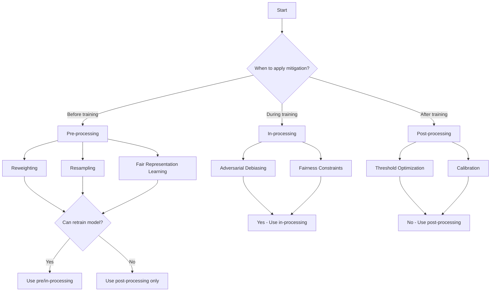

# Bias Detection and Mitigation Algorithms

## Overview

This document details the algorithms implemented in ExFairness for detecting and mitigating bias in ML systems.

## Bias Detection Algorithms

### 1. Statistical Parity Testing

**Purpose**: Detect violations of demographic parity using statistical hypothesis tests.

**Algorithm**:
```
Input: predictions, sensitive_attr, alpha (significance level)
Output: test_statistic, p_value, reject_null

1. Compute observed rates:
   rate_A = mean(predictions[sensitive_attr == 0])
   rate_B = mean(predictions[sensitive_attr == 1])

2. Under null hypothesis (no disparity):
   SE = sqrt(p(1-p)(1/n_A + 1/n_B))
   where p = (n_A * rate_A + n_B * rate_B) / (n_A + n_B)

3. Test statistic:
   z = (rate_A - rate_B) / SE

4. P-value:
   p_value = 2 * P(Z > |z|)  # Two-tailed test

5. Decision:
   reject_null = p_value < alpha
```

**Implementation**:
```elixir
def statistical_parity_test(predictions, sensitive_attr, opts \\ []) do
  alpha = Keyword.get(opts, :alpha, 0.05)

  group_a_mask = Nx.equal(sensitive_attr, 0)
  group_b_mask = Nx.equal(sensitive_attr, 1)

  n_a = Nx.sum(group_a_mask) |> Nx.to_number()
  n_b = Nx.sum(group_b_mask) |> Nx.to_number()

  rate_a = positive_rate(predictions, group_a_mask) |> Nx.to_number()
  rate_b = positive_rate(predictions, group_b_mask) |> Nx.to_number()

  p_pooled = (n_a * rate_a + n_b * rate_b) / (n_a + n_b)
  se = :math.sqrt(p_pooled * (1 - p_pooled) * (1/n_a + 1/n_b))

  z_stat = (rate_a - rate_b) / se
  p_value = 2 * (1 - Statistics.Distributions.Normal.cdf(abs(z_stat), 0, 1))

  %{
    test_statistic: z_stat,
    p_value: p_value,
    reject_null: p_value < alpha,
    interpretation: interpret_test_result(p_value, alpha)
  }
end
```

---

### 2. Intersectional Bias Detection

**Purpose**: Identify bias in combinations of sensitive attributes.

**Algorithm**:
```
Input: predictions, labels, [attr1, attr2, ...], metric
Output: bias_map, most_disadvantaged_group

1. Create all attribute combinations:
   groups = cartesian_product(unique(attr1), unique(attr2), ...)

2. For each group g:
   a. Filter data: data_g = data[matches_group(g)]
   b. Compute metric: metric_g = compute_metric(data_g)
   c. Store: bias_map[g] = metric_g

3. Find reference group (typically majority):
   ref_group = group with best metric value

4. Compute disparities:
   For each group g:
     disparity_g = |metric_g - metric_ref|

5. Identify most disadvantaged:
   most_disadvantaged = argmax(disparity_g)
```

**Implementation**:
```elixir
def intersectional_fairness(predictions, labels, opts) do
  sensitive_attrs = Keyword.fetch!(opts, :sensitive_attrs)
  attr_names = Keyword.get(opts, :attr_names, 1..length(sensitive_attrs))
  metric = Keyword.get(opts, :metric, :true_positive_rate)

  # Create all combinations
  groups = create_intersectional_groups(sensitive_attrs)

  # Compute metric for each group
  results = Enum.map(groups, fn group_mask ->
    group_predictions = Nx.select(group_mask, predictions, 0)
    group_labels = Nx.select(group_mask, labels, 0)

    value = compute_metric(metric, group_predictions, group_labels)
    count = Nx.sum(group_mask) |> Nx.to_number()

    {group_mask, value, count}
  end)

  # Find reference (highest metric)
  {_ref_mask, ref_value, _ref_count} = Enum.max_by(results, fn {_, v, _} -> v end)

  # Compute disparities
  disparities = Enum.map(results, fn {mask, value, count} ->
    {mask, abs(value - ref_value), count}
  end)

  most_disadvantaged = Enum.max_by(disparities, fn {_, disp, _} -> disp end)

  %{
    group_metrics: results,
    disparities: disparities,
    most_disadvantaged: most_disadvantaged,
    reference_value: ref_value
  }
end
```

---

### 3. Temporal Bias Drift Detection

**Purpose**: Monitor fairness metrics over time to detect degradation.

**Algorithm** (CUSUM - Cumulative Sum Control Chart):
```
Input: metric_values_over_time, threshold
Output: drift_detected, change_point

1. Initialize:
   S_pos = 0, S_neg = 0
   baseline = mean(metric_values[initial_period])

2. For each time t:
   deviation = metric_values[t] - baseline

   S_pos = max(0, S_pos + deviation - allowance)
   S_neg = max(0, S_neg - deviation - allowance)

   if S_pos > threshold or S_neg > threshold:
     return drift_detected = true, change_point = t

3. Return drift_detected = false
```

**Implementation**:
```elixir
def temporal_drift(metrics_history, opts \\ []) do
  threshold = Keyword.get(opts, :threshold, 0.05)
  allowance = Keyword.get(opts, :allowance, 0.01)
  baseline_period = Keyword.get(opts, :baseline_period, 10)

  # Extract values and timestamps
  {timestamps, values} = Enum.unzip(metrics_history)

  # Compute baseline
  baseline = Enum.take(values, baseline_period)
  |> Enum.sum()
  |> Kernel./(baseline_period)

  # CUSUM
  {drift_detected, change_point, s_pos, s_neg} =
    values
    |> Enum.with_index()
    |> Enum.reduce_while({false, nil, 0, 0}, fn {value, idx}, {_, _, s_pos, s_neg} ->
      deviation = value - baseline

      new_s_pos = max(0, s_pos + deviation - allowance)
      new_s_neg = max(0, s_neg - deviation - allowance)

      if new_s_pos > threshold or new_s_neg > threshold do
        {:halt, {true, Enum.at(timestamps, idx), new_s_pos, new_s_neg}}
      else
        {:cont, {false, nil, new_s_pos, new_s_neg}}
      end
    end)

  %{
    drift_detected: drift_detected,
    change_point: change_point,
    drift_magnitude: max(s_pos, s_neg),
    alert_level: classify_alert(max(s_pos, s_neg), threshold)
  }
end
```

---

### 4. Label Bias Detection

**Purpose**: Identify bias in training labels themselves.

**Algorithm** (Label Distribution Analysis):
```
Input: labels, features, sensitive_attr
Output: bias_indicators

1. For each sensitive group:
   a. Compute label distribution:
      P(Y=1 | A=a, X=x)

   b. For similar feature vectors across groups:
      Find pairs (x_i, x_j) where d(x_i, x_j) < threshold
      but A_i ≠ A_j

   c. Compute label discrepancy:
      discrepancy = |Y_i - Y_j| for similar pairs

2. Statistical test:
   H0: No label bias
   H1: Label bias exists

   Test if discrepancy is significantly greater than
   expected by chance
```

**Implementation**:
```elixir
def detect_label_bias(labels, features, sensitive_attr, opts \\ []) do
  similarity_threshold = Keyword.get(opts, :similarity_threshold, 0.1)
  min_pairs = Keyword.get(opts, :min_pairs, 100)

  # Find similar cross-group pairs
  similar_pairs = find_similar_cross_group_pairs(
    features,
    sensitive_attr,
    similarity_threshold
  )

  # Compute label discrepancies
  discrepancies = Enum.map(similar_pairs, fn {i, j} ->
    abs(Nx.to_number(labels[i]) - Nx.to_number(labels[j]))
  end)

  mean_discrepancy = Enum.sum(discrepancies) / length(discrepancies)

  # Baseline: discrepancy for random pairs
  random_pairs = sample_random_pairs(length(similar_pairs))
  baseline_discrepancies = Enum.map(random_pairs, fn {i, j} ->
    abs(Nx.to_number(labels[i]) - Nx.to_number(labels[j]))
  end)
  baseline_mean = Enum.sum(baseline_discrepancies) / length(baseline_discrepancies)

  # Statistical test
  {t_stat, p_value} = t_test(discrepancies, baseline_discrepancies)

  %{
    mean_discrepancy: mean_discrepancy,
    baseline_discrepancy: baseline_mean,
    excess_discrepancy: mean_discrepancy - baseline_mean,
    test_statistic: t_stat,
    p_value: p_value,
    bias_detected: p_value < 0.05
  }
end
```

---

## Bias Mitigation Algorithms

### 1. Reweighting (Pre-processing)

**Purpose**: Adjust training sample weights to achieve fairness.

**Algorithm**:
```
Input: data, sensitive_attr, target_metric
Output: weights

1. Compute group and label combinations:
   groups = {(A=0, Y=0), (A=0, Y=1), (A=1, Y=0), (A=1, Y=1)}

2. For each combination (a, y):
   P_a_y = P(A=a, Y=y)  # Observed probability
   P_a = P(A=a)
   P_y = P(Y=y)

3. Compute ideal weights for demographic parity:
   w(a, y) = P_y / P_a_y

   # Intuition: Up-weight underrepresented combinations

4. Normalize weights:
   weights = weights / mean(weights)
```

**Implementation**:
```elixir
def reweight(labels, sensitive_attr, opts \\ []) do
  target = Keyword.get(opts, :target, :demographic_parity)

  # Compute observed probabilities
  n = Nx.size(labels)

  group_label_counts = %{
    {0, 0} => count_where(sensitive_attr, 0, labels, 0),
    {0, 1} => count_where(sensitive_attr, 0, labels, 1),
    {1, 0} => count_where(sensitive_attr, 1, labels, 0),
    {1, 1} => count_where(sensitive_attr, 1, labels, 1)
  }

  # Compute probabilities
  probs = Map.new(group_label_counts, fn {{a, y}, count} ->
    {{a, y}, count / n}
  end)

  # Marginal probabilities
  p_a0 = probs[{0, 0}] + probs[{0, 1}]
  p_a1 = probs[{1, 0}] + probs[{1, 1}]
  p_y0 = probs[{0, 0}] + probs[{1, 0}]
  p_y1 = probs[{0, 1}] + probs[{1, 1}]

  # Compute weights
  weights = Nx.broadcast(0.0, labels)

  weights = case target do
    :demographic_parity ->
      # w(a,y) = P(y) / P(a,y)
      compute_demographic_parity_weights(sensitive_attr, labels, probs, p_y0, p_y1)

    :equalized_odds ->
      # w(a,y) = P(y) / (P(a) * P(a,y))
      compute_equalized_odds_weights(sensitive_attr, labels, probs, p_a0, p_a1, p_y0, p_y1)
  end

  # Normalize
  weights = Nx.divide(weights, Nx.mean(weights))

  weights
end
```

---

### 2. Threshold Optimization (Post-processing)

**Purpose**: Find group-specific decision thresholds to satisfy fairness constraints.

**Algorithm** (for Equalized Odds):
```
Input: probabilities, labels, sensitive_attr
Output: threshold_A, threshold_B

1. Define objective:
   Maximize accuracy subject to:
   |TPR_A - TPR_B| ≤ ε
   |FPR_A - FPR_B| ≤ ε

2. Grid search over threshold pairs:
   For t_A in [0, 1]:
     For t_B in [0, 1]:
       predictions_A = (probs_A >= t_A)
       predictions_B = (probs_B >= t_B)

       TPR_A, FPR_A = compute_rates(predictions_A, labels_A)
       TPR_B, FPR_B = compute_rates(predictions_B, labels_B)

       if |TPR_A - TPR_B| ≤ ε and |FPR_A - FPR_B| ≤ ε:
         accuracy = compute_accuracy(predictions_A, predictions_B, labels)
         if accuracy > best_accuracy:
           best = (t_A, t_B, accuracy)

3. Return best thresholds
```

**Implementation**:
```elixir
def optimize_thresholds(probabilities, labels, sensitive_attr, opts \\ []) do
  target_metric = Keyword.get(opts, :target_metric, :equalized_odds)
  epsilon = Keyword.get(opts, :epsilon, 0.05)
  grid_size = Keyword.get(opts, :grid_size, 100)

  group_a_mask = Nx.equal(sensitive_attr, 0)
  group_b_mask = Nx.equal(sensitive_attr, 1)

  probs_a = Nx.select(group_a_mask, probabilities, 0.0)
  probs_b = Nx.select(group_b_mask, probabilities, 0.0)
  labels_a = Nx.select(group_a_mask, labels, 0)
  labels_b = Nx.select(group_b_mask, labels, 0)

  # Grid search
  thresholds = Nx.linspace(0.0, 1.0, n: grid_size)

  best = Enum.reduce(thresholds, {nil, 0.0}, fn t_a, {best_thresholds, best_acc} ->
    Enum.reduce(thresholds, {best_thresholds, best_acc}, fn t_b, {curr_best, curr_acc} ->
      preds_a = Nx.greater_equal(probs_a, t_a)
      preds_b = Nx.greater_equal(probs_b, t_b)

      {tpr_a, fpr_a} = compute_rates(preds_a, labels_a)
      {tpr_b, fpr_b} = compute_rates(preds_b, labels_b)

      satisfies_constraint = case target_metric do
        :equalized_odds ->
          abs(tpr_a - tpr_b) <= epsilon and abs(fpr_a - fpr_b) <= epsilon
        :equal_opportunity ->
          abs(tpr_a - tpr_b) <= epsilon
      end

      if satisfies_constraint do
        accuracy = compute_overall_accuracy(preds_a, preds_b, labels_a, labels_b)
        if accuracy > curr_acc do
          {{t_a, t_b}, accuracy}
        else
          {curr_best, curr_acc}
        end
      else
        {curr_best, curr_acc}
      end
    end)
  end)

  {thresholds, accuracy} = best

  %{
    group_a_threshold: elem(thresholds, 0),
    group_b_threshold: elem(thresholds, 1),
    accuracy: accuracy
  }
end
```

---

### 3. Adversarial Debiasing (In-processing)

**Purpose**: Train a model to maximize accuracy while minimizing an adversary's ability to predict sensitive attributes.

**Algorithm**:
```
Input: features X, labels Y, sensitive_attr A
Output: fair_model

1. Model architecture:
   - Predictor: f(X) -> Ŷ
   - Adversary: g(f(X)) -> Â

2. Loss function:
   L = L_prediction(Ŷ, Y) - λ * L_adversary(Â, A)

   where:
   - L_prediction: Standard loss (cross-entropy, MSE)
   - L_adversary: Adversary loss (tries to predict A from f(X))
   - λ: Adversarial strength parameter

3. Training:
   Alternate between:
   a. Update predictor: Minimize L w.r.t. predictor parameters
   b. Update adversary: Maximize L_adversary w.r.t. adversary parameters

4. At convergence:
   - Predictor is accurate
   - Adversary cannot predict sensitive attribute from predictor's representations
```

**Implementation** (Axon integration):
```elixir
def adversarial_debiasing(features, labels, sensitive_attr, opts \\ []) do
  adversary_strength = Keyword.get(opts, :adversary_strength, 0.5)
  hidden_dim = Keyword.get(opts, :hidden_dim, 64)

  # Predictor network
  predictor = Axon.input("features")
  |> Axon.dense(hidden_dim, activation: :relu, name: "predictor_hidden")
  |> Axon.dense(1, activation: :sigmoid, name: "predictor_output")

  # Adversary network (takes predictor hidden layer)
  adversary = Axon.nx(predictor, & &1["predictor_hidden"])
  |> Axon.dense(32, activation: :relu)
  |> Axon.dense(1, activation: :sigmoid, name: "adversary_output")

  # Combined loss
  loss_fn = fn predictor_out, adversary_out, y, a ->
    prediction_loss = Axon.Losses.binary_cross_entropy(y, predictor_out)
    adversary_loss = Axon.Losses.binary_cross_entropy(a, adversary_out)

    prediction_loss - adversary_strength * adversary_loss
  end

  # Training loop
  # ... (Alternating updates to predictor and adversary)

  predictor
end
```

---

### 4. Fair Representation Learning

**Purpose**: Learn a representation of data that is independent of sensitive attributes but useful for prediction.

**Algorithm** (Variational Fair Autoencoder):
```
Input: features X, sensitive_attr A
Output: encoder, decoder

1. Encoder: q(Z | X)
   Maps X to latent representation Z

2. Decoder: p(X | Z)
   Reconstructs X from Z

3. Loss function:
   L = L_reconstruction + L_KL + λ * L_independence

   where:
   - L_reconstruction = -E[log p(X | Z)]
   - L_KL = KL(q(Z|X) || p(Z))  # VAE regularization
   - L_independence = MMD(Z[A=0], Z[A=1])  # Maximum Mean Discrepancy

4. Training:
   Minimize L to get representations Z that:
   - Preserve information (reconstruction)
   - Are regularized (KL divergence)
   - Are independent of A (MMD)
```

**Implementation**:
```elixir
def fair_representation(features, sensitive_attr, opts \\ []) do
  latent_dim = Keyword.get(opts, :latent_dim, 32)
  lambda = Keyword.get(opts, :independence_weight, 1.0)

  # Encoder
  encoder = Axon.input("features")
  |> Axon.dense(64, activation: :relu)
  |> Axon.dense(latent_dim * 2)  # Mean and log-variance

  # Sampling layer
  {z_mean, z_log_var} = split_encoder_output(encoder)
  z = sample_z(z_mean, z_log_var)

  # Decoder
  decoder = z
  |> Axon.dense(64, activation: :relu)
  |> Axon.dense(feature_dim, activation: :sigmoid)

  # MMD loss
  mmd_loss = fn z, sensitive ->
    z_group_0 = Nx.select(Nx.equal(sensitive, 0), z, 0)
    z_group_1 = Nx.select(Nx.equal(sensitive, 1), z, 0)

    maximum_mean_discrepancy(z_group_0, z_group_1)
  end

  # Total loss
  loss = fn x, x_recon, z_mean, z_log_var, z, a ->
    recon_loss = binary_cross_entropy(x, x_recon)
    kl_loss = -0.5 * Nx.sum(1 + z_log_var - Nx.power(z_mean, 2) - Nx.exp(z_log_var))
    independence_loss = mmd_loss.(z, a)

    recon_loss + kl_loss + lambda * independence_loss
  end

  # Train and return encoder
  {encoder, decoder}
end
```

---

## Algorithm Selection Guide



## Performance Considerations

### Computational Complexity

| Algorithm | Complexity | Notes |
|-----------|------------|-------|
| Reweighting | O(n) | Very fast |
| Threshold Optimization | O(n × g²) | g = grid size |
| Adversarial Debiasing | O(n × epochs × layer_size) | Training time |
| Fair Representation | O(n × epochs × layer_size) | Training time |
| Intersectional Detection | O(n × 2^k) | k = number of attributes |

### Scalability

For large datasets:
1. Use sampling for grid search
2. Parallelize intersectional analysis
3. Use mini-batch training for neural approaches
4. Leverage GPU acceleration via EXLA

---

## References

1. Kamiran, F., & Calders, T. (2012). Data preprocessing techniques for classification without discrimination. *KAIS*.
2. Hardt, M., et al. (2016). Equality of opportunity in supervised learning. *NeurIPS*.
3. Zhang, B. H., et al. (2018). Mitigating unwanted biases with adversarial learning. *AIES*.
4. Louizos, C., et al. (2016). The variational fair autoencoder. *ICLR*.
5. Feldman, M., et al. (2015). Certifying and removing disparate impact. *KDD*.
