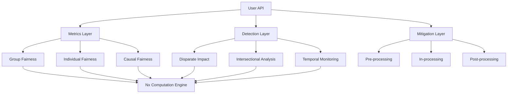
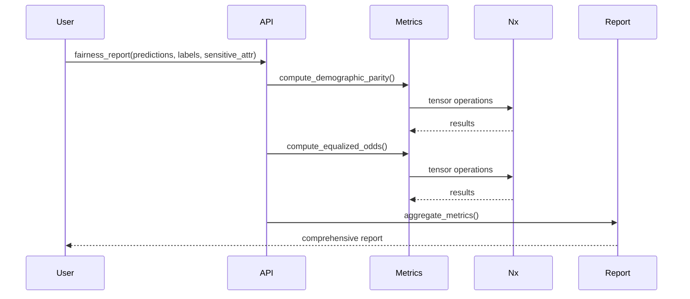

# ExFairness Architecture

## Overview

ExFairness is designed as a modular, composable library for fairness analysis in ML systems. The architecture follows functional programming principles and leverages Elixir's strengths in concurrent processing and data transformation.

## System Architecture



## Core Components

### 1. Metrics Layer

The metrics layer implements mathematical definitions of fairness:

- **Group Fairness Metrics**: Demographic parity, equalized odds, equal opportunity
- **Individual Fairness Metrics**: Lipschitz continuity, similarity-based fairness
- **Causal Fairness Metrics**: Counterfactual fairness, path-specific effects

**Design Pattern**: Pure functions that take predictions, labels, and sensitive attributes as Nx tensors and return fairness measurements.

### 2. Detection Layer

The detection layer identifies bias in data and models:

- **Statistical Testing**: Hypothesis tests for fairness violations
- **Intersectional Analysis**: Multi-dimensional fairness across attribute combinations
- **Temporal Monitoring**: Time-series analysis of fairness drift

**Design Pattern**: Higher-order functions that compose metric calculations with statistical analysis.

### 3. Mitigation Layer

The mitigation layer provides bias correction techniques:

- **Pre-processing**: Data transformation before model training
- **In-processing**: Fairness constraints during model training
- **Post-processing**: Prediction adjustment after model training

**Design Pattern**: Transformation pipelines that can be composed and configured.

### 4. Reporting Layer

The reporting layer generates comprehensive fairness assessments:

- **Metric Aggregation**: Combine multiple fairness metrics
- **Interpretation**: Provide actionable recommendations
- **Export**: Generate reports in multiple formats

## Data Flow



## Module Organization

### Primary Modules

```
ExFairness/
├── ExFairness                        # Main API module
├── ExFairness.Metrics/
│   ├── DemographicParity
│   ├── EqualizedOdds
│   ├── EqualOpportunity
│   ├── PredictiveParity
│   ├── Calibration
│   ├── IndividualFairness
│   └── Counterfactual
├── ExFairness.Detection/
│   ├── DisparateImpact
│   ├── StatisticalParity
│   ├── Intersectional
│   ├── TemporalDrift
│   ├── LabelBias
│   └── Representation
├── ExFairness.Mitigation/
│   ├── Reweighting
│   ├── Resampling
│   ├── ThresholdOptimization
│   ├── AdversarialDebiasing
│   ├── FairRepresentation
│   └── Calibration
├── ExFairness.Report
└── ExFairness.Utils
```

## Design Principles

### 1. Tensor-First Design

All computations use Nx tensors for:
- Performance optimization
- GPU acceleration support
- Functional composition
- Type safety

```elixir
# Example: Demographic parity calculation
def demographic_parity(predictions, sensitive_attr) do
  group_a_mask = Nx.equal(sensitive_attr, 0)
  group_b_mask = Nx.equal(sensitive_attr, 1)

  rate_a = compute_positive_rate(predictions, group_a_mask)
  rate_b = compute_positive_rate(predictions, group_b_mask)

  %{disparity: abs(rate_a - rate_b), ...}
end
```

### 2. Composability

Functions are designed to be composed:

```elixir
predictions
|> ExFairness.Metrics.DemographicParity.compute(sensitive_attr)
|> ExFairness.Detection.StatisticalParity.test(threshold: 0.1)
|> ExFairness.Report.interpret()
```

### 3. Configuration Over Convention

All metrics accept configuration options:

```elixir
ExFairness.equalized_odds(
  predictions,
  labels,
  sensitive_attr,
  threshold: 0.05,
  confidence_level: 0.95,
  bootstrap_samples: 1000
)
```

### 4. Immutability

All operations are pure and return new data structures:

```elixir
{fair_data, weights} = ExFairness.Mitigation.reweight(data, sensitive_attr)
# Original data is unchanged
```

## Performance Considerations

### Tensor Operations

- All metrics use vectorized Nx operations
- Avoid loops; use tensor operations
- Support for GPU backends (EXLA, Torchx)

### Parallel Processing

- Metrics can be computed in parallel using Task.async_stream
- Intersectional analysis parallelized across subgroups

```elixir
metrics = [:demographic_parity, :equalized_odds, :equal_opportunity]

results = Task.async_stream(metrics, fn metric ->
  apply(ExFairness.Metrics, metric, [predictions, labels, sensitive_attr])
end, max_concurrency: System.schedulers_online())
```

### Caching

- Reuse intermediate computations (confusion matrices, rates)
- Cache expensive operations (bootstrap sampling)

## Extension Points

### Custom Metrics

Users can define custom fairness metrics:

```elixir
defmodule MyCustomMetric do
  @behaviour ExFairness.Metric

  def compute(predictions, labels, sensitive_attr, opts) do
    # Custom metric implementation
  end

  def interpret(result) do
    # Custom interpretation
  end
end

ExFairness.fairness_report(predictions, labels, sensitive_attr,
  custom_metrics: [MyCustomMetric]
)
```

### Custom Mitigation

Users can implement custom mitigation strategies:

```elixir
defmodule MyMitigationStrategy do
  @behaviour ExFairness.Mitigation

  def apply(data, sensitive_attr, opts) do
    # Custom mitigation implementation
  end
end
```

## Integration Points

### With Nx/Axon

```elixir
# During model training
model = Axon.input("features")
|> Axon.dense(64, activation: :relu)
|> Axon.dense(1, activation: :sigmoid)

# Add fairness constraint
model = ExFairness.Mitigation.add_fairness_constraint(
  model,
  sensitive_attr_index: 3,
  constraint: :demographic_parity
)
```

### With Scholar

```elixir
# Evaluate fairness of Scholar models
model = Scholar.linear_regression(x_train, y_train)
predictions = Scholar.predict(model, x_test)

ExFairness.fairness_report(predictions, y_test, sensitive_attr)
```

### With Explorer

```elixir
# Work with DataFrames
df = Explorer.DataFrame.from_csv("data.csv")

predictions = df["predictions"] |> Explorer.Series.to_tensor()
labels = df["labels"] |> Explorer.Series.to_tensor()
sensitive = df["race"] |> Explorer.Series.to_tensor()

ExFairness.fairness_report(predictions, labels, sensitive)
```

## Testing Strategy

### Unit Tests

- Each metric has comprehensive unit tests
- Test edge cases (empty tensors, single-group data)
- Test numerical stability

### Property-Based Tests

```elixir
property "demographic_parity is symmetric" do
  check all predictions <- tensor(:int, shape: {100}),
            sensitive <- tensor(:int, shape: {100}) do

    result1 = ExFairness.demographic_parity(predictions, sensitive)
    result2 = ExFairness.demographic_parity(predictions, 1 - sensitive)

    assert_in_delta(result1.disparity, result2.disparity, 0.001)
  end
end
```

### Integration Tests

- Test full pipelines (detection -> mitigation -> validation)
- Test with real-world datasets
- Benchmark performance

## Error Handling

### Input Validation

```elixir
def demographic_parity(predictions, sensitive_attr) do
  validate_tensors!(predictions, sensitive_attr)
  validate_binary_predictions!(predictions)
  validate_binary_groups!(sensitive_attr)

  # Computation
end
```

### Informative Errors

```elixir
raise ExFairness.Error, """
Insufficient samples in group B (n=5).
Fairness metrics require at least 30 samples per group for reliable estimates.
Consider using bootstrap methods or collecting more data.
"""
```

## Future Architecture Enhancements

1. **Distributed Computation**: Support for analyzing large datasets across multiple nodes
2. **Streaming Metrics**: Online fairness monitoring for production systems
3. **AutoML Integration**: Automated fairness-aware hyperparameter tuning
4. **Causal Discovery**: Automated causal graph learning for counterfactual fairness
5. **Explainability Integration**: Combine with SHAP/LIME for bias explanation
