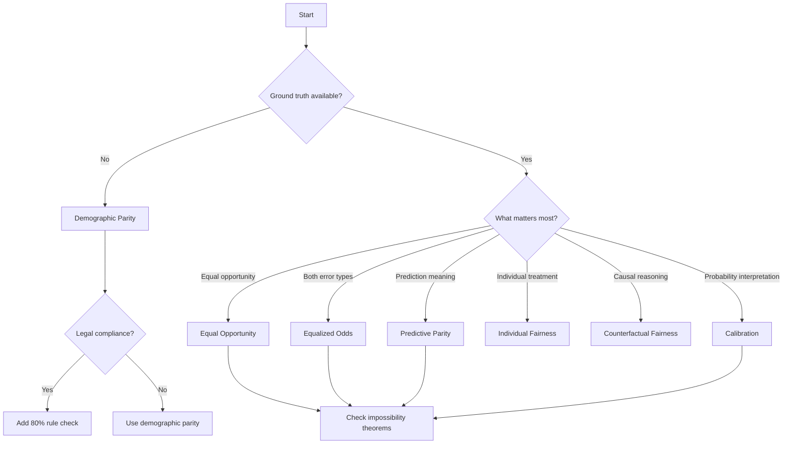

# Fairness Metrics Specifications

## Overview

This document provides detailed mathematical specifications for all fairness metrics implemented in ExFairness.

## Notation

- $Y$: True label
- $\hat{Y}$: Predicted label
- $A$: Sensitive attribute (e.g., race, gender)
- $X$: Feature vector
- $P(\cdot)$: Probability
- $E[\cdot]$: Expectation

## Group Fairness Metrics

### 1. Demographic Parity (Statistical Parity)

**Definition**: The probability of a positive prediction should be equal across groups.

$$P(\hat{Y} = 1 | A = 0) = P(\hat{Y} = 1 | A = 1)$$

**Disparity Measure**:
$$\Delta_{DP} = |P(\hat{Y} = 1 | A = 0) - P(\hat{Y} = 1 | A = 1)|$$

**When to Use**:
- When equal representation in positive outcomes is required
- Advertising, content recommendation
- When base rates can differ between groups

**Limitations**:
- Ignores base rate differences in actual outcomes
- May conflict with accuracy if base rates differ
- Can be satisfied by a random classifier

**Implementation**:
```elixir
def demographic_parity(predictions, sensitive_attr, opts \\ []) do
  threshold = Keyword.get(opts, :threshold, 0.1)

  group_a_mask = Nx.equal(sensitive_attr, 0)
  group_b_mask = Nx.equal(sensitive_attr, 1)

  rate_a = positive_rate(predictions, group_a_mask)
  rate_b = positive_rate(predictions, group_b_mask)

  disparity = Nx.abs(Nx.subtract(rate_a, rate_b)) |> Nx.to_number()

  %{
    group_a_rate: Nx.to_number(rate_a),
    group_b_rate: Nx.to_number(rate_b),
    disparity: disparity,
    passes: disparity <= threshold,
    threshold: threshold
  }
end
```

---

### 2. Equalized Odds

**Definition**: True positive and false positive rates should be equal across groups.

$$P(\hat{Y} = 1 | Y = 1, A = 0) = P(\hat{Y} = 1 | Y = 1, A = 1)$$
$$P(\hat{Y} = 1 | Y = 0, A = 0) = P(\hat{Y} = 1 | Y = 0, A = 1)$$

**Disparity Measures**:
$$\Delta_{TPR} = |TPR_{A=0} - TPR_{A=1}|$$
$$\Delta_{FPR} = |FPR_{A=0} - FPR_{A=1}|$$

**When to Use**:
- When both false positives and false negatives matter
- Criminal justice (both wrongful conviction and wrongful acquittal are serious)
- Medical diagnosis (both missed diagnoses and false alarms matter)

**Limitations**:
- Requires ground truth labels
- Can be impossible to achieve with demographic parity when base rates differ
- May reduce overall accuracy

**Implementation**:
```elixir
def equalized_odds(predictions, labels, sensitive_attr, opts \\ []) do
  threshold = Keyword.get(opts, :threshold, 0.1)

  group_a_mask = Nx.equal(sensitive_attr, 0)
  group_b_mask = Nx.equal(sensitive_attr, 1)

  # Group A
  tpr_a = true_positive_rate(predictions, labels, group_a_mask)
  fpr_a = false_positive_rate(predictions, labels, group_a_mask)

  # Group B
  tpr_b = true_positive_rate(predictions, labels, group_b_mask)
  fpr_b = false_positive_rate(predictions, labels, group_b_mask)

  tpr_disparity = Nx.abs(Nx.subtract(tpr_a, tpr_b)) |> Nx.to_number()
  fpr_disparity = Nx.abs(Nx.subtract(fpr_a, fpr_b)) |> Nx.to_number()

  %{
    group_a_tpr: Nx.to_number(tpr_a),
    group_b_tpr: Nx.to_number(tpr_b),
    group_a_fpr: Nx.to_number(fpr_a),
    group_b_fpr: Nx.to_number(fpr_b),
    tpr_disparity: tpr_disparity,
    fpr_disparity: fpr_disparity,
    passes: tpr_disparity <= threshold and fpr_disparity <= threshold
  }
end
```

---

### 3. Equal Opportunity

**Definition**: True positive rate (recall) should be equal across groups.

$$P(\hat{Y} = 1 | Y = 1, A = 0) = P(\hat{Y} = 1 | Y = 1, A = 1)$$

**Disparity Measure**:
$$\Delta_{EO} = |TPR_{A=0} - TPR_{A=1}|$$

**When to Use**:
- When the cost of false negatives varies by group
- Hiring (missing qualified candidates)
- College admissions
- Opportunity allocation

**Limitations**:
- Only considers true positive rate, ignores false positive rate
- Requires ground truth labels
- May allow different false positive rates

**Implementation**:
```elixir
def equal_opportunity(predictions, labels, sensitive_attr, opts \\ []) do
  threshold = Keyword.get(opts, :threshold, 0.1)

  group_a_mask = Nx.equal(sensitive_attr, 0)
  group_b_mask = Nx.equal(sensitive_attr, 1)

  tpr_a = true_positive_rate(predictions, labels, group_a_mask)
  tpr_b = true_positive_rate(predictions, labels, group_b_mask)

  disparity = Nx.abs(Nx.subtract(tpr_a, tpr_b)) |> Nx.to_number()

  %{
    group_a_tpr: Nx.to_number(tpr_a),
    group_b_tpr: Nx.to_number(tpr_b),
    disparity: disparity,
    passes: disparity <= threshold,
    interpretation: interpret_equal_opportunity(disparity, threshold)
  }
end
```

---

### 4. Predictive Parity (Outcome Test)

**Definition**: Positive predictive value (precision) should be equal across groups.

$$P(Y = 1 | \hat{Y} = 1, A = 0) = P(Y = 1 | \hat{Y} = 1, A = 1)$$

**Disparity Measure**:
$$\Delta_{PP} = |PPV_{A=0} - PPV_{A=1}|$$

**When to Use**:
- When the meaning of a positive prediction should be consistent
- Risk assessment tools
- Credit scoring

**Limitations**:
- Can be incompatible with equalized odds when base rates differ
- Requires ground truth labels
- May allow different selection rates

---

### 5. Calibration

**Definition**: For any predicted probability, actual outcomes should be equal across groups.

$$P(Y = 1 | S(X) = s, A = 0) = P(Y = 1 | S(X) = s, A = 1)$$

where $S(X)$ is the model's score function.

**Disparity Measure** (per bin):
$$\Delta_{Cal}(b) = |P(Y = 1 | S(X) \in bin_b, A = 0) - P(Y = 1 | S(X) \in bin_b, A = 1)|$$

**When to Use**:
- When probability estimates must be interpretable
- Medical risk prediction
- Weather forecasting
- Any application where probabilities guide decisions

**Implementation**:
```elixir
def calibration(probabilities, labels, sensitive_attr, opts \\ []) do
  bins = Keyword.get(opts, :bins, 10)
  threshold = Keyword.get(opts, :threshold, 0.1)

  group_a_mask = Nx.equal(sensitive_attr, 0)
  group_b_mask = Nx.equal(sensitive_attr, 1)

  calibration_a = compute_calibration_curve(probabilities, labels, group_a_mask, bins)
  calibration_b = compute_calibration_curve(probabilities, labels, group_b_mask, bins)

  disparities = Enum.zip(calibration_a, calibration_b)
  |> Enum.map(fn {a, b} -> abs(a - b) end)

  max_disparity = Enum.max(disparities)

  %{
    calibration_a: calibration_a,
    calibration_b: calibration_b,
    disparities: disparities,
    max_disparity: max_disparity,
    passes: max_disparity <= threshold
  }
end
```

---

## Individual Fairness Metrics

### 6. Individual Fairness (Lipschitz Continuity)

**Definition**: Similar individuals should receive similar predictions.

$$d(\hat{Y}(x_1), \hat{Y}(x_2)) \leq L \cdot d(x_1, x_2)$$

where $L$ is the Lipschitz constant and $d$ is a distance metric.

**Measurement**:
For a set of similar pairs $(x_i, x_j)$:
$$\text{Fairness} = \frac{1}{|P|} \sum_{(i,j) \in P} \mathbb{1}[|f(x_i) - f(x_j)| \leq \epsilon]$$

**When to Use**:
- When individual treatment is important
- Personalized recommendations
- Custom pricing

**Challenges**:
- Requires defining similarity metric
- Computationally expensive for large datasets
- Similarity metric may be domain-specific

---

### 7. Counterfactual Fairness

**Definition**: A prediction is counterfactually fair if it is the same in the actual world and in a counterfactual world where the sensitive attribute is different.

$$P(\hat{Y}_{A \leftarrow a}(U) = y | X = x, A = a) = P(\hat{Y}_{A \leftarrow a'}(U) = y | X = x, A = a)$$

**When to Use**:
- When causal understanding is important
- Legal compliance (disparate treatment)
- High-stakes decisions

**Challenges**:
- Requires causal graph
- Unobserved confounders problematic
- Computationally intensive

---

## Disparate Impact Measures

### 80% Rule (4/5ths Rule)

**Definition**: The selection rate for the protected group should be at least 80% of the selection rate for the reference group.

$$\frac{P(\hat{Y} = 1 | A = 1)}{P(\hat{Y} = 1 | A = 0)} \geq 0.8$$

**Legal Context**: Used by EEOC in employment discrimination cases.

**Implementation**:
```elixir
def disparate_impact(predictions, sensitive_attr) do
  group_a_rate = positive_rate(predictions, Nx.equal(sensitive_attr, 0))
  group_b_rate = positive_rate(predictions, Nx.equal(sensitive_attr, 1))

  ratio = Nx.divide(group_b_rate, group_a_rate) |> Nx.to_number()

  %{
    ratio: ratio,
    passes_80_percent_rule: ratio >= 0.8,
    interpretation: interpret_disparate_impact(ratio)
  }
end
```

---

## Impossibility Theorems

### Chouldechova's Theorem

**Statement**: If base rates differ between groups ($P(Y=1|A=0) \neq P(Y=1|A=1)$), it is impossible to simultaneously satisfy:
1. Predictive parity
2. Equal false positive rates
3. Equal false negative rates

**Implication**: Must choose which fairness definition to prioritize.

### Kleinberg et al. Theorem

**Statement**: Except in degenerate cases, it is impossible to simultaneously satisfy:
1. Calibration
2. Balance for the positive class (equal TPR)
3. Balance for the negative class (equal TNR)

**Implication**: Trade-offs are necessary when base rates differ.

---

## Metric Selection Guide



## Intersectional Fairness

For multiple sensitive attributes $(A_1, A_2, ..., A_k)$, fairness metrics can be extended:

**Additive Intersectionality**:
Measure fairness for each attribute independently.

**Multiplicative Intersectionality**:
Measure fairness for all combinations of attributes.

**Example**: Gender × Race creates 4 groups: (Male, White), (Male, Black), (Female, White), (Female, Black)

---

## Confidence Intervals

All metrics should include confidence intervals:

**Bootstrap Method**:
```elixir
def demographic_parity_with_ci(predictions, sensitive_attr, opts \\ []) do
  result = demographic_parity(predictions, sensitive_attr, opts)

  # Bootstrap CI
  bootstrap_samples = Keyword.get(opts, :bootstrap_samples, 1000)
  ci_level = Keyword.get(opts, :confidence_level, 0.95)

  bootstrap_disparities = bootstrap(predictions, sensitive_attr, bootstrap_samples, fn p, s ->
    demographic_parity(p, s).disparity
  end)

  ci = percentile_ci(bootstrap_disparities, ci_level)

  Map.put(result, :confidence_interval, ci)
end
```

---

## References

1. Hardt, M., Price, E., & Srebro, N. (2016). Equality of opportunity in supervised learning. *NeurIPS*.
2. Chouldechova, A. (2017). Fair prediction with disparate impact. *Big Data*, 5(2), 153-163.
3. Kleinberg, J., Mullainathan, S., & Raghavan, M. (2016). Inherent trade-offs in the fair determination of risk scores. *ITCS*.
4. Dwork, C., Hardt, M., Pitassi, T., Reingold, O., & Zemel, R. (2012). Fairness through awareness. *ITCS*.
5. Kusner, M. J., Loftus, J., Russell, C., & Silva, R. (2017). Counterfactual fairness. *NeurIPS*.
